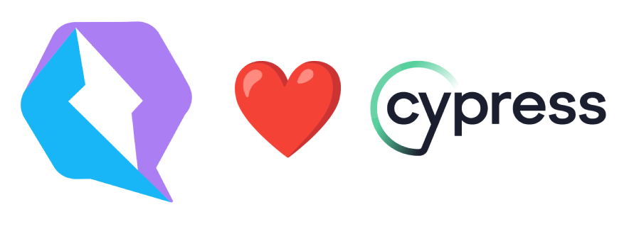

<p align="center">
<br/>
  
  <br/>
  <br/>
</p>

<h1 align='center'>Cypress Qwik plugin</h1>

<div align='center'>
  The cypress component testing plugin for <a href='https://github.com/BuilderIO/qwik'>Qwik</a>
  <br><br>

  <a href='https://img.shields.io/npm/v/cypress-ct-qwik?label=npm%20version'>
  
  </a>
  <a href='https://opensource.org/licenses/MIT'>
  
  </a>
  <a href='#contributors'>
  
  </a>

</div>
<br>

## Table of Contents

- [Installation](#installation)
- [Configuring Cypress](#configuring-cypress)
- [Usage](#usage)
- [Contributing](#contributing)
- [Code Of Conduct](#code-of-conduct)
- [Contributors](#contributors)
- [Related Links](#related-links)
- [License](#license)

## Installation

```console
npm install -D cypress-ct-qwik
```

## Configuring Cypress

```ts
// cypress.config.ts

import { defineConfig } from 'cypress';

export default defineConfig({
  component: {
    devServer: {
      mode: 'test',
      bundler: 'vite',
    } as any,
  },
});
```

Add `addQwikLoader` to the `component.ts` file -

```ts
// component.ts

import { addQwikLoader } from 'cypress-ct-qwik';

addQwikLoader();
```

## Usage

```ts
// some-test.cy.ts

import { mount } from 'cypress-ct-qwik';
import MyComp from './my-comp';

describe(`Qwik Component Test`, () => {
  it('should find my link', () => {
    mount(<MyComp />);

    cy.contains('myLink').should('exist');
  });
});
```

<br/>

## Contributing

Want to contribute? Yayy! 🎉

Please read and follow our [Contributing Guidelines](CONTRIBUTING.md) to learn what are the right steps to take before contributing your time, effort and code.

Thanks 🙏

<br/>

## Code Of Conduct

Be kind to each other and please read our [code of conduct](CODE_OF_CONDUCT.md).

<br/>

## Contributors

Thanks goes to these wonderful people ([emoji key](https://allcontributors.org/docs/en/emoji-key)):

<!-- ALL-CONTRIBUTORS-LIST:START - Do not remove or modify this section -->
<!-- prettier-ignore-start -->
<!-- markdownlint-disable -->
<table>
  <tbody>
    <tr>
      <td align="center" valign="top" width="14.28%"><a href="https://hirez.io/?utm_source=github&utm_medium=link&utm_campaign=cypress-qwik"><br /><sub><b>Shai Reznik</b></sub></a><br /><a href="https://github.com/qwikifiers/cypress-qwik/commits?author=shairez" title="Code">💻</a> <a href="https://github.com/qwikifiers/cypress-qwik/commits?author=shairez" title="Tests">⚠️</a> <a href="#infra-shairez" title="Infrastructure (Hosting, Build-Tools, etc)">🚇</a> <a href="https://github.com/qwikifiers/cypress-qwik/commits?author=shairez" title="Documentation">📖</a> <a href="#maintenance-shairez" title="Maintenance">🚧</a> <a href="https://github.com/qwikifiers/cypress-qwik/pulls?q=is%3Apr+reviewed-by%3Ashairez" title="Reviewed Pull Requests">👀</a> <a href="#ideas-shairez" title="Ideas, Planning, & Feedback">🤔</a></td>
    </tr>
   
  </tbody>
</table>

<!-- markdownlint-restore -->
<!-- prettier-ignore-end -->

<!-- ALL-CONTRIBUTORS-LIST:END -->

This project follows the [all-contributors](https://github.com/all-contributors/all-contributors) specification. Contributions of any kind welcome!

<br/>

## Related Links

- [Cypress-Qwik Discord](https://discord.gg/PVWUUejrez)
- [Qwik Discord](https://qwik.builder.io/chat)
- [Qwik Docs](https://qwik.builder.io/)
- [Cypress Docs](https://www.cypress.io/)

## License

MIT
